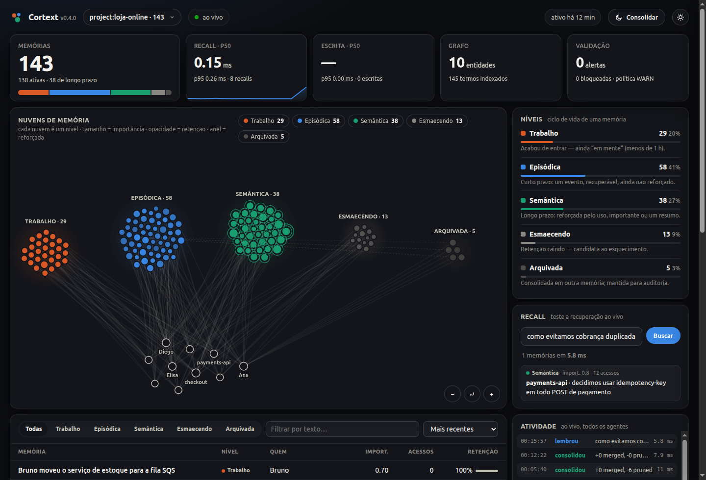

# Cortext

*Read this in [English](README.md).*

> **Memória de longo prazo para agentes de IA: um grafo de memória W5H indexado
> que grava e recupera em menos de um milissegundo, conecta-se ao Claude Code, ao
> Cursor e ao Copilot e mostra os níveis de memória num painel ao vivo.**



O Cortext dá ao agente uma memória *estruturada*, e não um vector store plano. Cada
memória é um registro **W5H** (quem, o quê, por quê, quando, onde, como), checado
contra o que já se sabe para que contradições não entrem, e recuperado por um parser
determinístico apoiado em índices, que devolve um bloco de contexto **compacto** em
vez de chunks crus. Python puro, **zero dependências obrigatórias**, local-first.

```bash
pip install cortext-memory
cortext-memory install claude     # ou: cursor | copilot | vscode | mcp
cortext-memory dashboard
```

## O que tem dentro

| | |
|---|---|
| **Grafo de memória indexado** | Índices invertidos por token, participante e local; os candidatos vêm dos índices, nunca de varredura. Entidades ligam as memórias num grafo. |
| **SQLite incremental** | Store em modo WAL que grava só o que mudou, um arquivo para todos os namespaces. Contadores de acesso são gravados em segundo plano, então leituras nunca esperam o disco. |
| **Níveis de memória** | trabalho → episódica → semântica → esmaecendo → arquivada, a partir de idade, reforço, importância e retenção de Ebbinghaus. |
| **Escrita ciente de contradições** | O `CanonicalValidator` sinaliza ou bloqueia `X` vs `não X` na escrita (níveis heurístico → embedding → LLM). |
| **Auto-poda** | Decaimento de Ebbinghaus, forget gate e um DreamAgent que une duplicatas e poda o que não é mais usado. Memórias importantes e resumos nunca são podados. |
| **Integração com agentes** | **Mod** do Claude Code (function hooks), **adaptador universal de hooks** (Claude Code, Cursor, Copilot), **servidor MCP** para qualquer cliente, instaladores de um comando. |
| **Painel de controle** | Painel ao vivo servido pelo daemon local: nuvens de memória por nível, latência, playground de recall, navegador de memórias, feed de atividade. |

## Desempenho

Medido com `python bench/latency_benchmark.py` (corpus sintético: 300
participantes, um verbo presente em 10% das memórias; Linux, CPython 3.10, NVMe).
As escritas são validadas **e** gravadas no SQLite antes de retornar.

| Memórias | Escrita + validação + persistência | Recall por participante | Recall por texto | Recarga a frio |
|---|---|---|---|---|
| 1.000 | 0,37 ms | 0,38 ms | 0,06 ms | 58 ms |
| 5.000 | 0,39 ms | 0,18 ms | 0,12 ms | 0,24 s |
| 20.000 | 0,44 ms | 0,53 ms | 0,26 ms | 0,93 s |
| 50.000 | 0,53 ms | 1,13 ms | 0,55 ms | 2,3 s |

O mesmo corpus na 0.3.1 (só em memória, nada persistido): com 20.000 memórias,
uma escrita levava **4,3 ms**, um recall **193 ms**, e salvar regravava o JSON
inteiro (**0,7 s**). São escritas ~10× mais rápidas e recall ~360× mais rápido, agora
com armazenamento durável. Via daemon, o recall de um hook de agente custa cerca de
1 ms, mais o início do processo.

Qualidade, com `python bench/run_benchmark.py` contra um baseline top-k não estruturado:

| Cenário | Tokens (baseline → Cortext) | Economia | P@5 (baseline → Cortext) | Detecção de contradição |
|---|---|---|---|---|
| customer_support | 540 → 115 | **78,7%** | 0,367 → 0,917 | 100% |
| personal_assistant | 380 → 88 | **76,8%** | 0,840 → 0,800 | 67% |
| **Média** | — | **77,8%** | **0,603 → 0,859** | 83,5% |

## Agentes de código

```bash
cortext-memory install claude              # Claude Code: mod de function hooks
cortext-memory install cursor              # Cursor: hooks + MCP (+ --project <repo> para a regra)
cortext-memory install copilot             # Copilot CLI: hooks + MCP
cortext-memory install vscode --project .  # Copilot Chat no VS Code: MCP + instruções
cortext-memory install mcp                 # imprime a configuração para qualquer outro cliente MCP
```

- **Claude Code**: o mod anexa a memória recuperada a cada prompt, grava cada turno
  concluído, dá ao modelo as ferramentas `memory_recall` / `memory_remember` /
  `memory_forget` e adiciona um pane `/memory` com os níveis. Também pode ser
  instalado com `/plugin install cortext --marketplace jhonymiler/Cortex`.
- **Cursor / Copilot**: os hooks injetam a memória de longo prazo do projeto no início
  da sessão e capturam cada turno. O recall por prompt passa pelas ferramentas MCP,
  guiado por um arquivo de instruções ("emulação de hooks").
- **Agentes sem hooks** (Windsurf, Claude Desktop, Codex, Gemini CLI, Zed, …): as
  instruções do servidor MCP fazem o modelo recuperar memória no início da tarefa,
  gravar fatos duráveis e registrar um resumo no fim.

Todos os agentes falam com um único daemon local (`127.0.0.1:7077`, iniciado sob
demanda), que mantém um grafo aquecido por projeto. Veja **[docs/AGENTS.md](docs/AGENTS.md)**.

## Biblioteca

```python
from cortext import CortextV5

cortex = CortextV5(namespace="myapp", path="~/.cortext/memory.db")  # path é opcional

cortex.remember(who=["Maria"], what="reportou erro de pagamento",
                why="cartão expirado", how="orientada a atualizar dados")

context, result = cortex.recall("O que Maria reportou?")
print(context)
# Maria | reportou erro de pagamento → orientada a atualizar dados

cortex.levels()        # {'working': 1, 'episodic': 0, 'semantic': 0, 'fading': 0, 'archived': 0}
cortex.stats()         # tamanhos, escritas, níveis, latência p50/p95
```

O `CortexV5` é thread-safe. Para o laço "recall antes da chamada, grava depois"
existe o `AgentMemoryBridge`, neutro de framework:

```python
from cortext.integration import AgentMemoryBridge

bridge = AgentMemoryBridge(namespace="session-1", path="~/.cortext/memory.db")
context = bridge.recall_context(user_input)                          # antes da chamada ao LLM
bridge.store_turn(user_message=user_input, assistant_message=reply)  # depois do turno
```

LangChain, LangGraph e outros frameworks: [docs/INTEGRATION.md](docs/INTEGRATION.md).
Hermes: `cortext-memory setup` instala o provider incluído no pacote, veja
[integrations/hermes/README.md](integrations/hermes/README.md).

## Como funciona

```
ESCRITA  W5H ─▶ CanonicalValidator (candidatos dos índices) ─▶ MemoryGraph ─▶ SQLite (só linhas alteradas)
RECALL   consulta ─▶ extrator (regex PT/EN/ES, LLM opcional) ─▶ candidatos indexados ─▶ ranking ─▶ bloco compacto
DECAY    retenção de Ebbinghaus + forget gate; o DreamAgent une duplicatas, poda e reforça
NÍVEIS   trabalho → episódica → semântica → esmaecendo → arquivada
```

Detalhes do design: [docs/ARCHITECTURE.md](docs/ARCHITECTURE.md).

## Instalação

```bash
pip install cortext-memory
pip install "cortext-memory[embeddings]"   # opcional: sentence-transformers para recall/validação por embedding
```

## Desenvolvimento

```bash
python3 -m venv .venv && .venv/bin/pip install -e ".[dev]"
.venv/bin/python -m pytest -q                  # 243 testes
.venv/bin/ruff check .
.venv/bin/python bench/latency_benchmark.py    # latência em escala
.venv/bin/python bench/run_benchmark.py        # economia de tokens / precisão
claude plugin test cortext/agents/claude_mod   # o mod do Claude Code
```

## Licença

MIT — veja [LICENSE](LICENSE).
